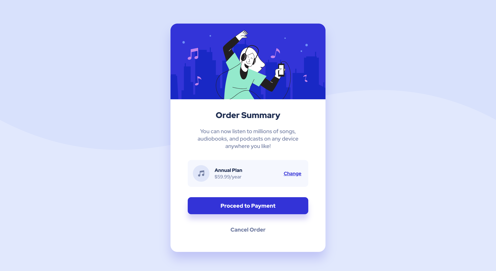

# Frontend Mentor - Order summary card solution

This is a solution to the [Order summary card challenge on Frontend Mentor](https://www.frontendmentor.io/challenges/order-summary-component-QlPmajDUj). Frontend Mentor challenges help you improve your coding skills by building realistic projects.

## Table of contents

- [Overview](#overview)
    - [The challenge](#the-challenge)
    - [Screenshot](#screenshot)
    - [Links](#links)
- [My process](#my-process)
    - [Built with](#built-with)
    - [What I learned](#what-i-learned)
    - [Useful resources](#useful-resources)
- [Author](#author)

## Overview

### The challenge

Users should be able to:

- See hover states for interactive elements

### Screenshot



### Links

- Solution URL: [GitHub link](https://github.com/limisie/fm-order-summary)
- Live Site URL: [GitHub pages live](https://limisie.github.io/fm-order-summary/)

## My process

### Built with

- CSS Flexbox
- [React](https://reactjs.org/) - React framework
- [Create React App](https://create-react-app.dev/) - Create React App setup
- [Styled Components](https://styled-components.com/) - For styles

### What I learned

A learned how to include SVG background:

```js
import desktopSVG from '../../assets/images/pattern-background-desktop.svg'
```

```css
background: url(${desktopSVG}) no-repeat fixed;
 ```

### Useful resources

- [Theme with styled-components](https://styled-components.com/docs/advanced) - I created theme and used ThemeProvider to access it.
- [Atomic Design](https://bradfrost.com/blog/post/atomic-web-design/) - I applied atomic design to structure the project. 

## Author

- Frontend Mentor - [@limisie](https://www.frontendmentor.io/profile/limisie)
- Twitter - [@limisiewicz](https://twitter.com/limisiewicz)

